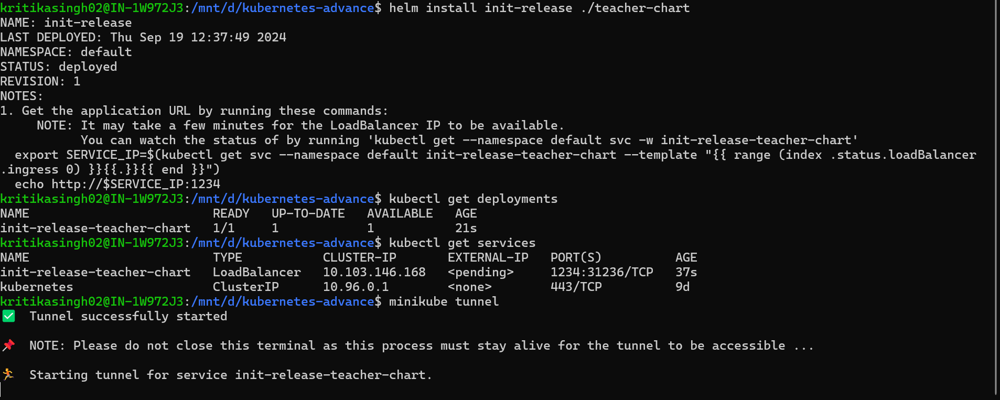
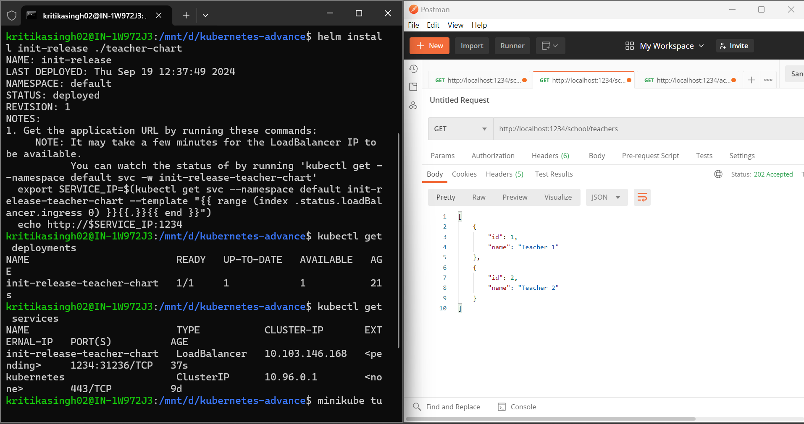
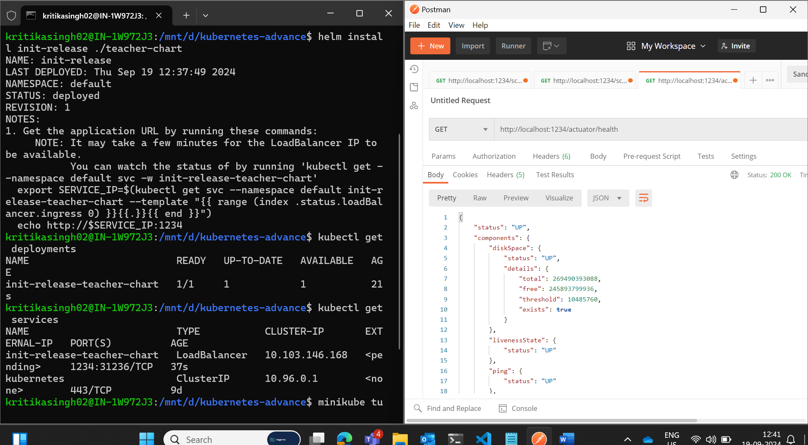
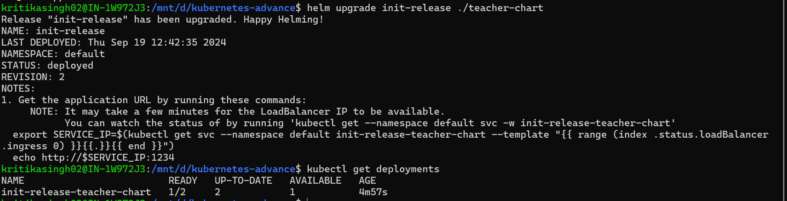
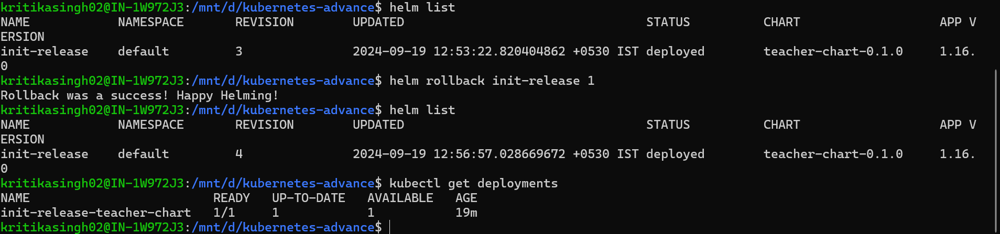
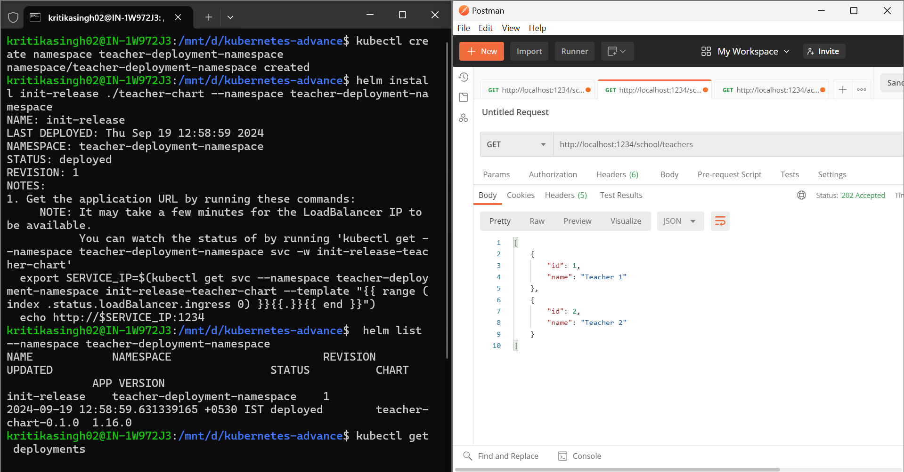
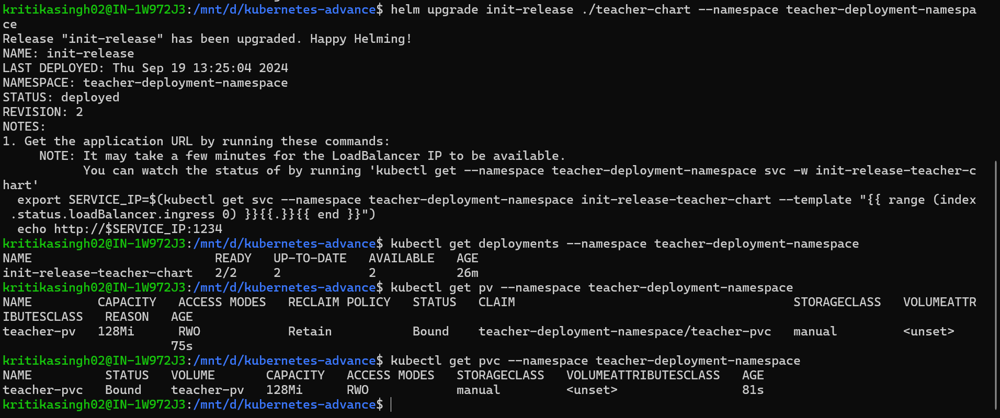

# Kubernetes Basic Assingment
1. Created one Springboot application that will show list of teachers.
2. API Url for teacher : http://localhost:8084/school/teacher
3. Application is Dockerize and I have created docker images:
   - kritikasingh02/teacher:v3

## Tech Stack:
1. Springboot
2. Docker
3. Kubectl
4. Minikube
5. Helm

## Project SetUp
1. clone git project - git clone https://github.com/kritika-singh-sengar/kubernetes-advance.git
2. Build Docker image:
   Open terminal: 
      > cd teacher
      > docker build -t teacher:v1 .
3. Tag Docker image:
   > docker tag teacher:v1 kritikasingh02/teacher:v1
4. Push Docker image to docker Hub:
   > docker login --username kritikasingh02
   > docker push kritikasingh02/teacher:v1

## Steps to run the application:

1. Start minikube and verify kubectl 
   > minikube start
   > kubectl cluster-info

2. Create helm chart:
   > helm create teacher-chart

3. Helm install:
   > helm install init-release ./teacher-chart
   
   
   

4. Update Helm:
   

5. Uninstall Helm:
   > helm install init-release ./teacher-chart

6. Helm rollback:
   
   
8. Helm with namespace:
   

9. Persistent storage and Persistent storage claim:
    
   